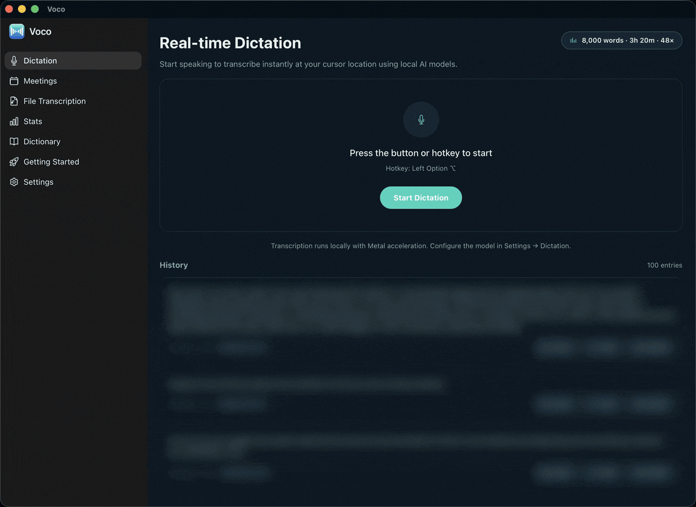
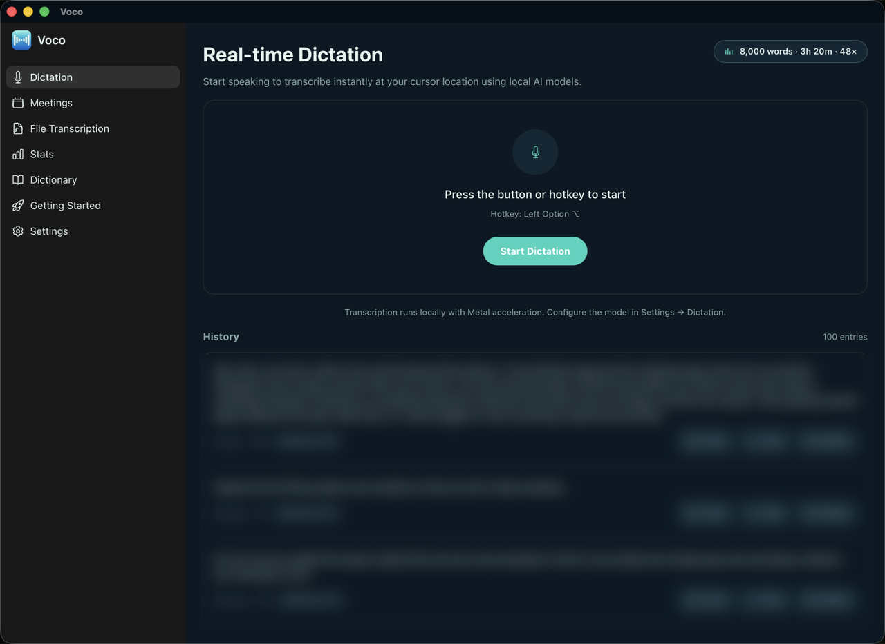
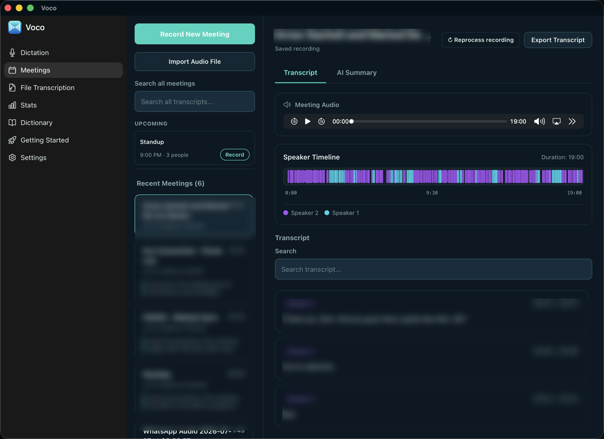
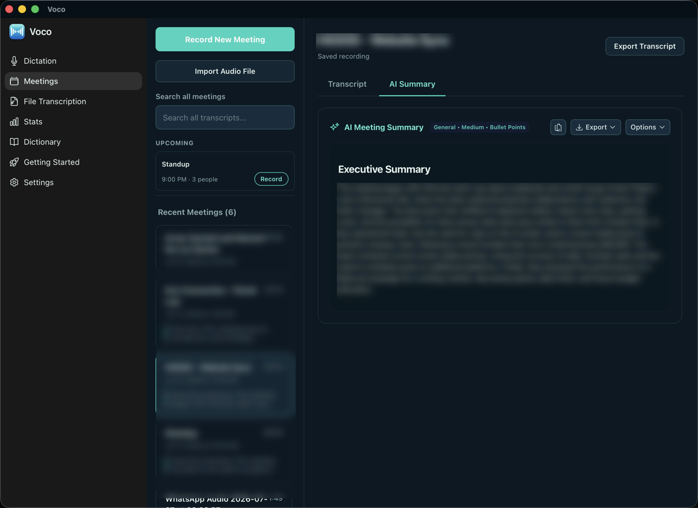
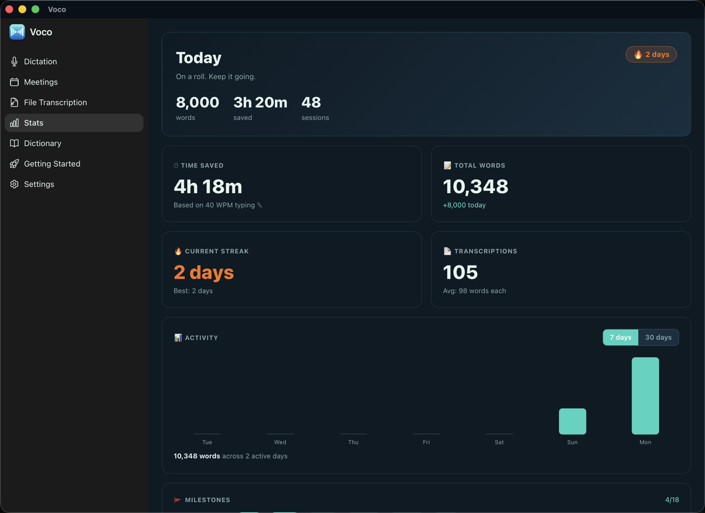
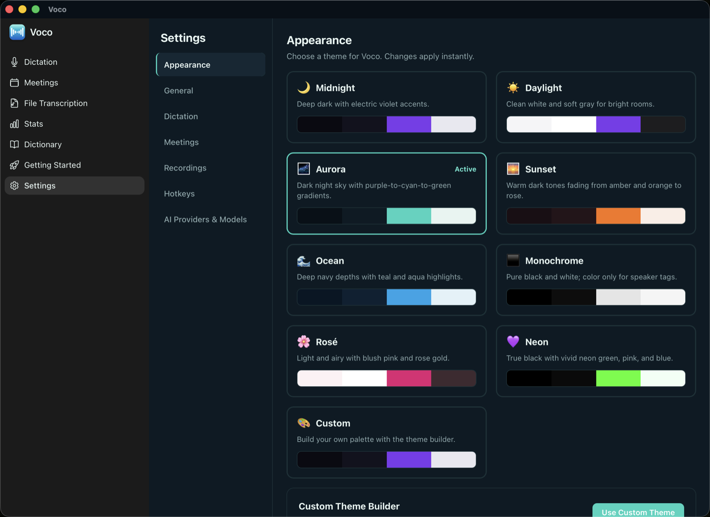
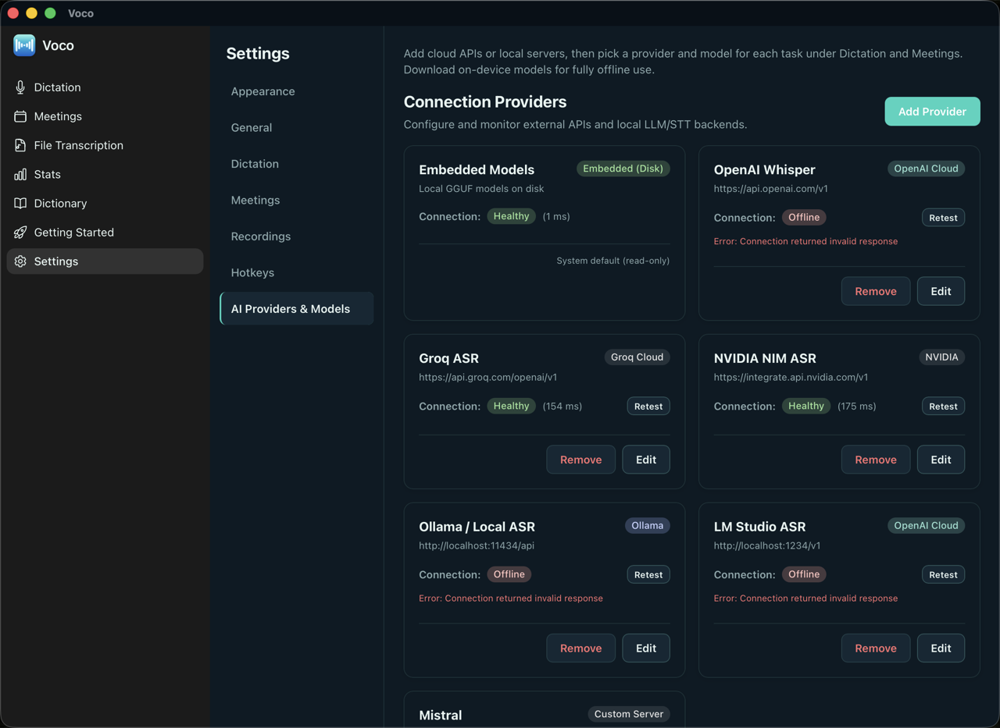

<div align="center">

# Voco

**Private, on-device voice dictation & meeting notes for macOS.**

Talk anywhere and get instant text at your cursor; record meetings and get diarized transcripts with AI summaries — all running locally by default, no cloud required.

<br/>



<sub>A quick tour of every screen. Personal data in this demo is blurred.</sub>

</div>

---

## What it does

- **Dictation** — press a hotkey (default **Left Option ⌥**), speak, and the transcribed text is pasted at your cursor in any app. Near‑instant start (the mic is kept "warm"), with app‑aware AI cleanup (punctuation, capitalization, custom dictionary, per‑app prompts).
- **Meetings** — records both your microphone and system audio (the other participants), transcribes, separates speakers, and writes structured AI notes. Transcription + diarization run in a single local model (MOSS‑Transcribe‑Diarize) as the finalize pass; a Granola‑style home shows your Google Calendar events, and each meeting gets a note‑first page with an ask‑anything AI bar.
- **Import & re‑process** — drop in an audio file (mp3/m4a/wav/flac) to transcribe it, or re‑run transcription on any saved recording.
- **Local‑first** — embedded speech‑to‑text (Whisper, Parakeet, Audio8‑ASR, MOSS‑Transcribe‑Diarize) and optional embedded LLM summaries run entirely on your Mac. Cloud providers (OpenAI, Groq, NVIDIA, Ollama, LM Studio) are optional.

## Install

> **Apple Silicon (arm64), macOS 12+.** Voco is **ad‑signed but not notarized** (it's a free, open‑source app with no paid Apple Developer account), so the installers below strip the Gatekeeper quarantine flag for you — no scary warnings.

### Homebrew (recommended)

```bash
brew install --cask kashyaparun25/voco/voco
```

Upgrade with `brew upgrade --cask voco`, remove with `brew uninstall --cask voco`.

### One‑line install

```bash
curl -fsSL https://raw.githubusercontent.com/kashyaparun25/voco/main/scripts/install.sh | bash
```

Downloads the latest release DMG, copies **Voco.app** to `/Applications`, and clears quarantine.

### Manual (DMG)

Download the latest `Voco_x.y.z_aarch64.dmg` from the [Releases page](https://github.com/kashyaparun25/voco/releases/latest), open it, and drag **Voco** into Applications. Because the build isn't notarized, the **first** launch needs one extra step (once only):

- **Right‑click** `Voco.app` → **Open** → **Open**, or
- run `xattr -cr /Applications/Voco.app` in Terminal.

On first launch, an onboarding wizard walks you through the permissions Voco needs (Microphone, Screen Recording, Accessibility, Input Monitoring), the model downloads (dictation + meeting intelligence), and AI‑notes setup (local LLM or a cloud provider).

## Highlights

- **Instant, clip‑free capture** — a pre‑armed ("warm") microphone means the first word is never cut off, with **no persistent orange mic indicator** (the mic only turns on while you dictate).
- **Live transcript in the pill** — the text appears in the dictation pill as you speak (a rolling Parakeet preview); the final pass replaces it before pasting.
- **Clipboard‑free text insertion** — dictated text is typed via unicode keyboard events targeted at the app that had focus when you started, so your clipboard stays untouched and it works reliably in Electron apps and terminals. Clipboard+⌘V and AppleScript remain as fallbacks, with a guarded clipboard restore.
- **Vocabulary boosting** — near‑miss transcriptions snap to your custom‑dictionary terms via guarded fuzzy matching, whatever engine you use.
- **Never lose a recording** — meeting audio is streamed to disk crash‑safely; if the app is force‑quit or crashes mid‑meeting, the recording is recovered on next launch and can be re‑transcribed. Failed dictations keep their audio too.
- **Smart media handling** — playing media (Apple Music, Spotify, browser video) is paused while you dictate and resumed after — and *only* if Voco was the one that paused it (works on macOS 15.4+/26 via an entitled MediaRemote bridge).
- **Note‑first meetings** — a Granola‑style "Coming up" home with your Google Calendar events (the live recording pinned on top), meeting pages where the AI notes *are* the page, the transcript in a bottom sheet with speaker chat bubbles and search, and a "My notes ↔ Enhanced" toggle for per‑meeting personal notes. Titles and AI notes are editable (with overwrite protection); descriptive subtitles are generated automatically.
- **Ask‑anything AI bar** — on the meetings home and each note page, ask questions about a meeting (or your recent meetings) using the same LLM that writes the notes, with recipe chips for action items, key decisions, and a follow‑up email draft.
- **Structured notes, 23 templates** — Google‑Meet / Granola / Meetily‑style templates (stand‑up, 1:1, customer discovery, sales, hiring, retrospective, board meeting, lecture, decision log, and more) with proper Markdown tables (action items with owner/due, decisions, topic‑by‑topic notes), plus a searchable template gallery, favorites, and editable custom templates. Short / medium / detailed length. Long meetings are summarized via adaptive map‑reduce so they never exceed a provider's token limits.
- **Speaker diarization** — transcription and diarization run jointly in one local model (MOSS‑Transcribe‑Diarize, English + Chinese) as the finalize pass after every meeting and import; pyannote relabeling remains the fallback and covers other languages. Click the speakers chip to rename speakers — with attendee‑name suggestions from the matching calendar event — and the notes regenerate with real names.
- **Your keys, your models** — per‑task provider/model selection; one connection can serve STT for dictation and an LLM for summaries without collision.

## Screenshots

> Personal data (names, transcripts, calendar email, file paths) is blurred in these shots.

**Real‑time dictation** — press the hotkey, speak, text lands at your cursor; every clip kept in local history.



**Meetings** — live transcript with neural speaker diarization, and structured AI summaries (Google‑Meet / Granola / Meetily‑style templates, tables, short/medium/detailed).

| Transcript + diarization | AI summary |
| --- | --- |
|  |  |

**Stats** and **themes** — usage dashboard, plus nine built‑in themes and a custom theme builder.

| Stats | Appearance |
| --- | --- |
|  |  |

**AI providers & models** — mix local (embedded) and cloud backends, pick a provider/model per task.



## Requirements

- **macOS 12+** (Apple Silicon recommended; some embedded models are arm64‑only).
- **Permissions** (macOS will prompt): Microphone, Screen Recording (for meeting system‑audio), Accessibility + Input Monitoring (for the global hotkey and paste).
- To build: **Rust** (stable) + **Node.js** + **pnpm/npm**.

## Build & run

```bash
# install JS deps
npm install

# dev
npm run tauri dev

# release .app bundle
npm run tauri build -- --bundles app
```

The release build signs with the self‑signed **"Voco Dev"** identity (see `tauri.conf.json`). If signing fails with `Voco Dev: no identity found`, re‑import the cert:

```bash
cd .signing
openssl pkcs12 -export -inkey key.pem -in cert.pem -out /tmp/voco.p12 -passout pass:voco -name "Voco Dev"
security import /tmp/voco.p12 -k ~/Library/Keychains/login.keychain-db -P voco -T /usr/bin/codesign
```

> The system `openssl` is LibreSSL — omit the `-legacy` flag. The cert imports as untrusted (self‑signed) but `codesign` still uses it.

### Cargo features

The default build already includes on‑device diarization + the ONNX STT stack. Feature flags in `src-tauri/Cargo.toml`:

| Feature | What it enables |
| --- | --- |
| `neural-diarization` | pyannote speaker separation — fallback diarizer (default) |
| `parakeet` | Parakeet TDT 0.6B ONNX STT (default) |
| `audio8` | Audio8‑ASR 0.1B native ONNX STT (default) |
| `moss` | MOSS‑Transcribe‑Diarize 0.9B joint STT+diarization finalize pass (default) |
| `embedded-llm` | Local GGUF LLM summaries via llama.cpp |
| `macos-native` | ScreenCaptureKit system audio + CGEvent paste |

## Speech‑to‑text engines

Voco supports several STT engines, selectable per task (Dictation / Meetings) in **Settings**:

- **Whisper** (embedded, GGUF via whisper.cpp) — download tiny→large‑v3 from the model list. Metal‑accelerated. Defaults to **English** (configurable).
- **Parakeet TDT 0.6B** (embedded, ONNX) — fast multilingual, downloaded on demand.
- **Audio8‑ASR 0.1B** (embedded, ONNX) — a tiny multilingual speech‑LLM (7 languages incl. Cantonese). Fully native — downloads ~0.9 GB on demand, no Python/server. Auto‑detects language.
- **MOSS‑Transcribe‑Diarize 0.9B** (embedded, GGUF via transcribe.cpp) — joint transcription + speaker diarization in one model, Metal‑accelerated. **English and Chinese only** (other languages use pyannote relabeling instead). ~987 MB download. Used as the finalize pass after meetings/imports; picking it as the meeting model means record‑then‑transcribe (no live captions, full diarized transcript on stop).
- **Cloud** — OpenAI Whisper, Groq, NVIDIA NIM, Ollama, LM Studio (OpenAI‑compatible). Bring your own key.

### Transcription language

**Settings → Recording → Transcription language** (default **English**). Applies to Whisper and cloud APIs (OpenAI/Groq); pick *Auto‑detect*, a language, or a custom ISO code. The embedded Audio8 model auto‑detects and ignores this setting.

## AI summaries

**Settings → Meetings → Summary** selects the LLM provider/model. Summaries use structured templates with tables. For transcripts that exceed a provider's per‑request token limit (e.g. Groq's free tier), Voco automatically condenses the transcript in chunks and then synthesizes the final summary — so it works regardless of meeting length. Choose a higher‑limit provider (or a local LLM) to summarize long meetings in a single fast pass.

## Privacy

- Nothing leaves your Mac unless you configure a cloud provider.
- The mic indicator appears **only while actively dictating/recording** — never at idle.
- Recordings are stored locally under Application Support (`Save recordings` is opt‑in; a crash‑safety buffer protects in‑progress recordings regardless).

## Coding-agent access (MCP)

Voco ships a local [Model Context Protocol](https://modelcontextprotocol.io) server so coding agents (Claude Code, Cursor, Windsurf, Codex CLI, Zed) can read your meetings, transcripts, summaries, notes, and dictation history on demand — "summarize yesterday's standup", or "put my last dictation into this commit message".

It's off by default. Turn it on under **Settings → Integrations**, which then shows a copy-paste command or JSON for each client, a one-click Cursor link, and a setup prompt you can paste into any agent to have it register Voco itself. For Claude Code:

```
claude mcp add voco -- /Applications/Voco.app/Contents/MacOS/voco-mcp
```

The server is a separate `voco-mcp` binary inside the app bundle. It opens `voco.db` read-only — it can never modify your data — and works whether or not the main app is running. Tools: `list_meetings`, `get_meeting`, `get_transcript` (paginated), `search`, `list_dictations`, `get_dictation`, `get_dictionary`, `get_status`. Every call is logged to `~/Library/Logs/Voco-MCP.log`. Design notes in [docs/mcp_integration_plan.md](docs/mcp_integration_plan.md).

## Project layout

```
src/                 React + TypeScript UI (windows/, components/, hooks/)
src-tauri/src/
  services/          dictation, meeting, media_control, hotkey, text_processing…
  stt/               whisper, parakeet, audio8, api (cloud), manager (downloads)
  llm/               summary prompt/templates, streaming client, engines
  diarization/       neural speaker separation
  audio/             capture (warm mic), mixer, resampler, VAD, system capture
  commands/mcp.rs    Integrations settings backend (enable, configs, test)
src-tauri/crates/
  voco-mcp/          read-only MCP sidecar (stdio JSON-RPC), bundled in the .app
scripts/audio8/      dev tools for the Audio8 model (reference server + golden dumps)
```

## Docs

- `CHANGELOG.md` — release notes.
- `docs/PROGRESS.md` — implementation status / history.
- `docs/` — original planning & audit notes (`implementation_plan.md`, `audit_*.md`), kept as historical snapshots.

## License

[MIT](LICENSE) © Arun Kashyap. Voco bundles third‑party models and frameworks under their respective licenses.
