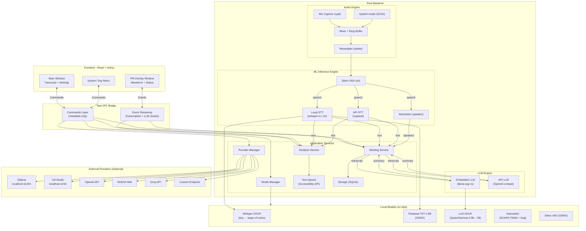
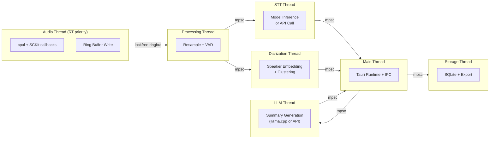

# Voco — Unified Voice Intelligence for macOS

> A lightweight, privacy-first macOS app that combines **real-time dictation** with **meeting recording & speaker diarization** — powered by local AI models, built with Tauri 2 + Rust + Astryx UI.

---

## Table of Contents

- [1. Problem Statement](#1-problem-statement)
- [2. Product Vision](#2-product-vision)
- [3. User Review Required](#3-user-review-required)
- [4. Technical Architecture](#4-technical-architecture)
- [5. Provider & Model System](#5-provider--model-system)
- [6. LLM Integration](#6-llm-integration)
- [7. STT Engine Options](#7-stt-engine-options)
- [8. Component Design](#8-component-design)
- [9. UI/UX Design & Theme System](#9-uiux-design--theme-system)
- [10. Implementation Phases](#10-implementation-phases)
- [11. Verification Plan](#11-verification-plan)
- [12. Best Practices & Guidelines](#12-best-practices--guidelines)

---

## 1. Problem Statement

You're currently using **two separate apps** for voice:
1. **FluidVoice** — for real-time dictation/transcription with a floating pill UI
2. **Meetily** — for meeting recording with speaker diarization

This creates:
- Context switching between apps
- Duplicate audio pipelines running simultaneously
- Inconsistent UX and settings management
- Two separate model downloads and storage
- No unified provider management (local vs cloud models)

**Voco** unifies both workflows into a single, efficient Rust-native application with a flexible provider system.

---

## 2. Product Vision

### Two Modes, One App

| Mode | Trigger | Behavior |
|------|---------|----------|
| **🎤 Dictation Mode** | Global hotkey (e.g., `⌘+Shift+Space`) | Floating pill with waveform appears. Speech → text, auto-pasted into active app. Pill disappears when done. |
| **📋 Meeting Mode** | Explicit "Start Meeting" button or hotkey | Captures system audio + mic. Real-time transcription with speaker diarization. Full transcript with speaker labels. AI-powered meeting summary. |

### Core Principles
- **Local-First** — All core features work 100% offline. Cloud APIs are optional enhancements.
- **Lightweight** — Rust backend, minimal memory footprint, no Python runtime
- **Beautiful** — Astryx (Meta's design system) with 8 curated themes
- **Fast** — Sub-second transcription latency, Metal-accelerated inference on Apple Silicon
- **Flexible** — Bring your own models, endpoints, and API keys

---

## 3. User Review Required

> [!IMPORTANT]
> **Frontend Framework**: Astryx is a **React** component library. The frontend will use React 18 + Vite + TypeScript. This is required for Astryx compatibility.

> [!WARNING]
> **macOS Private API**: The floating pill overlay requires `macOSPrivateApi: true` in Tauri config. This **prevents Mac App Store distribution**. App will be distributed via DMG/Homebrew. Is this acceptable?

> [!WARNING]
> **Screen Recording Permission**: Capturing system audio (meeting mode) requires **Screen & System Audio Recording** permission. The app will include an onboarding flow to guide users through this.

> [!NOTE]
> **Embedded LLM Size**: Running models directly in-app requires disk space and RAM. The smallest useful model (Qwen 0.5B Q4) needs ~350MB disk + ~500MB RAM. Users can opt to use Ollama/LM Studio instead for zero overhead.

---

## 4. Technical Architecture

### 4.1 Technology Stack

| Layer | Technology | Rationale |
|-------|-----------|-----------|
| **App Framework** | Tauri 2.x | Rust core + WebView frontend. ~5MB vs Electron's ~150MB |
| **Backend Language** | Rust | Memory-safe, zero-cost abstractions, excellent audio/ML ecosystem |
| **Frontend** | React 18 + TypeScript + Vite | Required by Astryx component library |
| **UI Components** | Astryx (`@astryxdesign/core`) | Meta's 150+ production components, dark mode, accessible |
| **Waveform Viz** | Custom Canvas + `react-audio-visualize` | Astryx doesn't include waveforms |
| **STT (Local)** | `whisper-rs` (whisper.cpp) + `ort` (ONNX) | whisper.cpp for Whisper, ort for Parakeet ONNX |
| **STT (API)** | `reqwest` HTTP client | OpenAI, NVIDIA NIM, Groq transcription APIs |
| **VAD** | Silero VAD via `ort` | Lightweight voice activity detection (~2MB) |
| **Diarization** | `speakrs` crate | Rust-native, CoreML, 500x+ real-time on Apple Silicon |
| **LLM (Local)** | `llama-cpp-rs` (llama.cpp) | Run GGUF models directly in-app, Metal acceleration |
| **LLM (API)** | `reqwest` + OpenAI-compatible | Ollama, LM Studio, OpenAI, custom endpoints |
| **Mic Capture** | `cpal` | Cross-platform audio I/O, CoreAudio on macOS |
| **System Audio** | `screencapturekit` / `cidre` | Native macOS ScreenCaptureKit binding |
| **Audio Processing** | `rubato` + `ringbuf` | Resample to 16kHz mono f32 for models |
| **Storage** | `rusqlite` (SQLite) | Transcripts, settings, speaker profiles, provider configs |
| **Window Effects** | `window-vibrancy` | Native frosted glass/vibrancy on macOS |
| **Hotkeys** | `tauri-plugin-global-shortcut` | System-wide keyboard shortcuts |
| **HTTP** | `reqwest` | API provider communication |

### 4.2 System Architecture



### 4.3 Thread Architecture



### 4.4 Data Models

```rust
// ═══════════════════════════════════════════
// PROVIDER & MODEL CONFIGURATION
// ═══════════════════════════════════════════

/// Where inference runs
enum ProviderType {
    /// Run model directly in-app (llama.cpp / whisper-rs / ort)
    Embedded,
    /// Local server (Ollama, LM Studio, vLLM)
    LocalServer,
    /// Cloud API (OpenAI, NVIDIA NIM, Groq, custom)
    CloudAPI,
}

/// A configured provider instance
struct Provider {
    id: Uuid,
    name: String,                    // "Ollama", "OpenAI", "My Custom Server"
    provider_type: ProviderType,
    base_url: Option<String>,        // "http://localhost:11434" or "https://api.openai.com"
    api_key: Option<String>,         // Encrypted at rest. None for local servers
    is_default_stt: bool,
    is_default_llm: bool,
    capabilities: Vec<Capability>,   // [STT, LLM, Diarization]
}

enum Capability { STT, LLM, Diarization }

/// A model available via a provider
struct ModelConfig {
    id: String,                      // "whisper-tiny", "parakeet-tdt-0.6b", "qwen2.5-7b"
    name: String,                    // Display name
    provider_id: Uuid,               // Which provider runs this
    model_type: ModelType,           // STT or LLM
    size_bytes: Option<u64>,         // Download size (for embedded models)
    ram_required_mb: Option<u32>,    // Estimated RAM usage
    is_downloaded: bool,             // For embedded models
    local_path: Option<PathBuf>,     // GGUF/ONNX file path
    remote_model_id: Option<String>, // "whisper-1", "gpt-4o-mini" (for API models)
    quantization: Option<String>,    // "Q4_K_M", "Q8_0", etc.
}

enum ModelType { STT, LLM }

// ═══════════════════════════════════════════
// TRANSCRIPTION
// ═══════════════════════════════════════════

struct TranscriptSegment {
    id: Uuid,
    meeting_id: Option<Uuid>,
    text: String,
    start_time: f64,
    end_time: f64,
    speaker_id: Option<String>,
    confidence: f32,
    words: Vec<WordTimestamp>,
}

struct WordTimestamp {
    word: String,
    start: f64,
    end: f64,
    confidence: f32,
}

// ═══════════════════════════════════════════
// MEETINGS
// ═══════════════════════════════════════════

struct Meeting {
    id: Uuid,
    title: String,
    started_at: DateTime<Utc>,
    ended_at: Option<DateTime<Utc>>,
    duration_seconds: f64,
    num_speakers: u32,
    speakers: Vec<Speaker>,
    segments: Vec<TranscriptSegment>,
    audio_path: Option<PathBuf>,
    summary: Option<MeetingSummary>,
    stt_provider: String,
    stt_model: String,
    llm_provider: Option<String>,
    llm_model: Option<String>,
}

struct MeetingSummary {
    overview: String,
    key_points: Vec<String>,
    action_items: Vec<ActionItem>,
    decisions: Vec<String>,
    generated_at: DateTime<Utc>,
    model_used: String,
}

struct ActionItem {
    description: String,
    assignee: Option<String>,    // Speaker name if identified
    deadline: Option<String>,
}

struct Speaker {
    id: String,
    label: String,
    color: String,
    total_speaking_time: f64,
    segment_count: u32,
}

// ═══════════════════════════════════════════
// APP CONFIGURATION
// ═══════════════════════════════════════════

struct AppConfig {
    // Dictation
    dictation_hotkey: String,
    dictation_stt_provider: Uuid,
    dictation_stt_model: String,
    auto_paste: bool,
    pill_position: PillPosition,
    dictation_mode: DictationMode,    // PushToTalk, Toggle, AutoStop
    
    // Meeting
    meeting_hotkey: String,
    meeting_stt_provider: Uuid,
    meeting_stt_model: String,
    meeting_llm_provider: Option<Uuid>,
    meeting_llm_model: Option<String>,
    save_audio: bool,
    auto_detect_speakers: bool,
    max_speakers: u32,
    auto_summarize: bool,
    
    // Appearance
    theme: ThemeId,
    pill_opacity: f32,
    
    // General
    language: String,
    models_dir: PathBuf,
    providers: Vec<Provider>,
}

enum DictationMode { PushToTalk, Toggle, AutoStop }
enum PillPosition { Top, Bottom, TopLeft, TopRight, BottomLeft, BottomRight, Custom(f64, f64) }
```

### 4.5 Project Structure

```
voco/
├── src-tauri/                          # Rust backend
│   ├── Cargo.toml
│   ├── tauri.conf.json
│   ├── capabilities/
│   │   ├── default.json
│   │   └── audio.json
│   ├── src/
│   │   ├── main.rs                     # Entry point (minimal)
│   │   ├── lib.rs                      # App setup, plugin registration
│   │   ├── commands/                   # Tauri IPC commands
│   │   │   ├── mod.rs
│   │   │   ├── dictation.rs            # start/stop dictation
│   │   │   ├── meeting.rs              # start/stop meeting, get transcript
│   │   │   ├── providers.rs            # CRUD providers, test connection
│   │   │   ├── models.rs               # list/download/delete models
│   │   │   ├── settings.rs             # get/set config
│   │   │   ├── audio.rs                # device listing, levels
│   │   │   └── llm.rs                  # summarize, regenerate summary
│   │   ├── audio/
│   │   │   ├── mod.rs
│   │   │   ├── mic_capture.rs          # cpal microphone
│   │   │   ├── system_capture.rs       # ScreenCaptureKit
│   │   │   ├── mixer.rs               # Audio mixing + ring buffer
│   │   │   ├── resampler.rs            # rubato → 16kHz mono f32
│   │   │   └── vad.rs                  # Silero VAD
│   │   ├── stt/                        # Speech-to-Text
│   │   │   ├── mod.rs
│   │   │   ├── engine.rs               # SttEngine trait
│   │   │   ├── whisper.rs              # whisper-rs (embedded)
│   │   │   ├── parakeet.rs             # ort + Parakeet ONNX (embedded)
│   │   │   └── api.rs                  # API-based STT (OpenAI, NVIDIA, Groq)
│   │   ├── llm/                        # LLM for summarization
│   │   │   ├── mod.rs
│   │   │   ├── engine.rs               # LlmEngine trait
│   │   │   ├── embedded.rs             # llama-cpp-rs (in-app GGUF)
│   │   │   ├── api.rs                  # OpenAI-compatible API client
│   │   │   └── prompts.rs              # Meeting summary prompt templates
│   │   ├── diarization/
│   │   │   ├── mod.rs
│   │   │   ├── engine.rs               # speakrs wrapper
│   │   │   ├── clustering.rs           # Speaker clustering
│   │   │   └── profiles.rs             # Speaker profile management
│   │   ├── providers/                  # Provider management
│   │   │   ├── mod.rs
│   │   │   ├── registry.rs             # Provider registry & lifecycle
│   │   │   ├── config.rs               # Provider configuration
│   │   │   └── health.rs               # Connection health checks
│   │   ├── services/
│   │   │   ├── mod.rs
│   │   │   ├── dictation.rs            # Dictation workflow
│   │   │   ├── meeting.rs              # Meeting workflow
│   │   │   ├── text_injector.rs        # macOS Accessibility paste
│   │   │   └── export.rs               # Export (TXT, SRT, JSON, MD)
│   │   ├── storage/
│   │   │   ├── mod.rs
│   │   │   ├── database.rs             # SQLite schema & queries
│   │   │   └── migrations.rs           # DB migrations
│   │   └── state.rs                    # Shared app state
│   └── icons/
│
├── src/                                # React frontend
│   ├── main.tsx                        # Entry + Astryx CSS imports
│   ├── App.tsx                         # Root + routing
│   ├── styles/
│   │   ├── index.css                   # Astryx imports + tokens
│   │   ├── themes/                     # Theme definitions
│   │   │   ├── midnight.css
│   │   │   ├── aurora.css
│   │   │   ├── sunset.css
│   │   │   ├── ocean.css
│   │   │   ├── monochrome.css
│   │   │   └── custom.css
│   │   ├── pill.css
│   │   └── waveform.css
│   ├── windows/
│   │   ├── PillWindow.tsx              # Floating pill overlay
│   │   ├── MainWindow.tsx              # Main app window
│   │   └── SettingsWindow.tsx          # Settings (could be tab/modal)
│   ├── components/
│   │   ├── waveform/
│   │   │   ├── WaveformPill.tsx
│   │   │   └── WaveformCanvas.tsx
│   │   ├── transcript/
│   │   │   ├── TranscriptView.tsx
│   │   │   ├── SegmentCard.tsx
│   │   │   └── SpeakerBadge.tsx
│   │   ├── meeting/
│   │   │   ├── MeetingControls.tsx
│   │   │   ├── MeetingTimer.tsx
│   │   │   ├── SpeakerTimeline.tsx
│   │   │   ├── MeetingList.tsx
│   │   │   └── MeetingSummary.tsx       # AI summary display
│   │   ├── providers/
│   │   │   ├── ProviderList.tsx         # List configured providers
│   │   │   ├── ProviderForm.tsx         # Add/edit provider
│   │   │   ├── ProviderStatus.tsx       # Connection status indicator
│   │   │   └── ApiKeyInput.tsx          # Secure API key input
│   │   ├── models/
│   │   │   ├── ModelSelector.tsx        # Model picker (grouped by tier)
│   │   │   ├── ModelDownloader.tsx      # Download progress
│   │   │   ├── ModelCard.tsx            # Model info card
│   │   │   └── ModelRecommendations.tsx # Recommended models by tier
│   │   ├── settings/
│   │   │   ├── GeneralSettings.tsx
│   │   │   ├── DictationSettings.tsx
│   │   │   ├── MeetingSettings.tsx
│   │   │   ├── ProviderSettings.tsx
│   │   │   ├── ModelSettings.tsx
│   │   │   ├── ThemeSettings.tsx
│   │   │   └── HotkeySettings.tsx
│   │   └── common/
│   │       ├── AudioLevelMeter.tsx
│   │       ├── StatusIndicator.tsx
│   │       └── ThemePreview.tsx
│   ├── hooks/
│   │   ├── useTauriEvent.ts
│   │   ├── useAudioLevel.ts
│   │   ├── useTranscription.ts
│   │   ├── useMeeting.ts
│   │   ├── useProviders.ts
│   │   └── useTheme.ts
│   └── lib/
│       ├── tauri.ts
│       ├── types.ts
│       └── themes.ts                    # Theme definitions & utilities
│
├── package.json
├── vite.config.ts
├── tsconfig.json
└── README.md
```

---

## 5. Provider & Model System

### 5.1 Architecture: Clean Provider/Model Separation

The app has a clear two-axis system:

```
┌─────────────────────────────────────────────────────────────────┐
│                    PROVIDER (Where to run)                      │
├─────────────┬─────────────────────────────────────────────────-─┤
│             │           MODEL (What to run)                     │
│             ├─────────────────────┬────────────────────────────-┤
│             │  Speech-to-Text     │  LLM (Summarization)       │
│ ┌─────────┐ │                     │                             │
│ │Embedded │ │ • Whisper Tiny      │ • Qwen2.5-0.5B-Instruct    │
│ │(in-app) │ │ • Whisper Small     │ • Qwen2.5-1.5B-Instruct    │
│ │         │ │ • Whisper Medium    │ • Gemma 2 2B               │
│ │No setup │ │ • Whisper LgV3 Turbo│ • Gemma 3 4B               │
│ │required │ │ • distil-whisper-lg │ • Qwen2.5-7B-Instruct      │
│ │         │ │ • Parakeet TDT 0.6B │                             │
│ └─────────┘ │                     │                             │
│ ┌─────────┐ │                     │                             │
│ │Ollama   │ │ • (any pulled model)│ • (any pulled model)       │
│ │Local    │ │                     │                             │
│ │:11434   │ │                     │                             │
│ └─────────┘ │                     │                             │
│ ┌─────────┐ │                     │                             │
│ │LM Studio│ │ • (any loaded model)│ • (any loaded model)       │
│ │Local    │ │                     │                             │
│ │:1234    │ │                     │                             │
│ └─────────┘ │                     │                             │
│ ┌─────────┐ │                     │                             │
│ │OpenAI   │ │ • whisper-1         │ • gpt-4o-mini              │
│ │Cloud    │ │                     │ • gpt-4o                   │
│ │API Key  │ │                     │                             │
│ └─────────┘ │                     │                             │
│ ┌─────────┐ │                     │                             │
│ │NVIDIA   │ │ • parakeet-ctc-1.1b │ • (N/A)                    │
│ │NIM      │ │                     │                             │
│ │API Key  │ │                     │                             │
│ └─────────┘ │                     │                             │
│ ┌─────────┐ │                     │                             │
│ │Groq     │ │ • whisper-large-v3  │ • llama-3.1-8b             │
│ │Cloud    │ │ • whisper-lg-turbo  │ • gemma2-9b-it             │
│ │API Key  │ │                     │                             │
│ └─────────┘ │                     │                             │
│ ┌─────────┐ │                     │                             │
│ │Custom   │ │ • (user-specified)  │ • (user-specified)         │
│ │Endpoint │ │                     │                             │
│ │Optional │ │                     │                             │
│ │API Key  │ │                     │                             │
│ └─────────┘ │                     │                             │
└─────────────┴─────────────────────┴─────────────────────────────┘
```

### 5.2 Settings UI Flow

```
Settings → Providers
├── 📦 Embedded (always present, non-removable)
│   ├── Status: Active ✅
│   ├── Downloaded Models: Whisper Tiny, Qwen2.5-1.5B
│   └── [Manage Models →]
│
├── 🦙 Ollama
│   ├── Endpoint: http://localhost:11434
│   ├── Status: Connected ✅  (or ❌ Not Running)
│   ├── Available Models: llama3.1:8b, qwen2.5:7b, ...
│   └── [Edit] [Remove] [Test Connection]
│
├── 🔑 OpenAI
│   ├── API Key: sk-...****
│   ├── Status: Valid ✅
│   └── [Edit] [Remove] [Test Connection]
│
└── [+ Add Provider]
    ├── Ollama (localhost:11434)
    ├── LM Studio (localhost:1234)
    ├── OpenAI (api.openai.com)
    ├── NVIDIA NIM (integrate.api.nvidia.com)
    ├── Groq (api.groq.com)
    └── Custom Endpoint...
```

```
Settings → Dictation
├── Hotkey: ⌘+Shift+Space  [Change]
├── Mode: ○ Push-to-Talk  ● Toggle  ○ Auto-Stop
├── STT Provider: [Embedded ▾]
├── STT Model: [Whisper Small ▾]
│   └── Shows only models from selected provider
├── Auto-paste: [ON]
└── Pill Position: [Bottom Center ▾]
```

```
Settings → Meetings
├── Hotkey: ⌘+Shift+M  [Change]
├── STT Provider: [Embedded ▾]
├── STT Model: [Parakeet TDT 0.6B ▾]
├── Auto-summarize: [ON]
│   ├── LLM Provider: [Ollama ▾]
│   └── LLM Model: [qwen2.5:7b ▾]
├── Save Audio: [ON]
├── Auto-detect speakers: [ON]
└── Max speakers: [8 ▾]
```

### 5.3 Provider Configuration API

```rust
// Tauri commands for provider management

#[tauri::command]
async fn list_providers(state: State<'_, AppState>) -> Result<Vec<Provider>>;

#[tauri::command]
async fn add_provider(config: ProviderConfig) -> Result<Provider>;

#[tauri::command]
async fn update_provider(id: Uuid, config: ProviderConfig) -> Result<Provider>;

#[tauri::command]
async fn remove_provider(id: Uuid) -> Result<()>;

#[tauri::command]
async fn test_provider(id: Uuid) -> Result<ProviderHealthStatus>;

#[tauri::command]
async fn list_provider_models(id: Uuid) -> Result<Vec<ModelInfo>>;

// Health status
struct ProviderHealthStatus {
    connected: bool,
    latency_ms: Option<u32>,
    error: Option<String>,
    available_models: Vec<String>,
}
```

---

## 6. LLM Integration

### 6.1 Embedded LLM (In-App, No External Dependencies)

Using `llama-cpp-rs` to run GGUF models directly inside the app:

```rust
use llama_cpp::LlamaModel;

struct EmbeddedLlm {
    model: Option<LlamaModel>,
    model_path: PathBuf,
}

impl EmbeddedLlm {
    fn load(&mut self, path: &Path) -> Result<()> {
        let params = LlamaParams::default()
            .with_n_gpu_layers(99)    // Offload all layers to Metal
            .with_n_ctx(4096)         // Context window
            .with_use_mmap(true);     // Memory-mapped for fast loading
        self.model = Some(LlamaModel::load(path, params)?);
        Ok(())
    }
    
    async fn summarize(&self, transcript: &str, tx: mpsc::Sender<String>) -> Result<String> {
        let prompt = prompts::meeting_summary(transcript);
        let session = self.model.as_ref().unwrap().create_session()?;
        session.advance(&prompt)?;
        
        // Stream tokens to UI
        let mut full_response = String::new();
        for token in session.generate_iter(1024) {
            let token_str = token?;
            full_response.push_str(&token_str);
            tx.send(token_str).await?;  // Stream to frontend
        }
        Ok(full_response)
    }
}
```

### 6.2 Recommended LLM Models (Tiered by Size)

| Tier | Model | Params | GGUF Q4 Size | RAM | Quality | Best For |
|------|-------|--------|-------------|-----|---------|----------|
| 🟢 **Nano** | Qwen2.5-0.5B-Instruct | 500M | ~350MB | ~500MB | Basic | Quick bullet summaries on low-RAM Macs |
| 🔵 **Tiny** | Qwen2.5-1.5B-Instruct | 1.5B | ~900MB | ~1.2GB | Decent | Good summaries, low resource usage |
| 🟣 **Small** | Gemma 2 2B Instruct | 2.6B | ~1.5GB | ~2GB | Good | Balanced quality and speed |
| 🟠 **Medium** | Gemma 3 4B Instruct | 4B | ~2.5GB | ~3GB | Very Good | Detailed summaries with action items |
| 🔴 **Large** | Qwen2.5-7B-Instruct | 7.6B | ~4.5GB | ~5.5GB | Excellent | Best local quality, needs 16GB+ RAM |

> [!TIP]
> **Recommendations by Mac:**
> - **8GB RAM Mac**: Use Nano or Tiny (Qwen 0.5B or 1.5B)
> - **16GB RAM Mac**: Use Small or Medium (Gemma 2B or 4B)
> - **32GB+ RAM Mac**: Use Large (Qwen 7B) for best quality
> - **Or**: Skip embedded LLM entirely and use Ollama/LM Studio/OpenAI API

### 6.3 API-Based LLM (OpenAI-Compatible)

For users running Ollama, LM Studio, or using cloud APIs:

```rust
struct ApiLlm {
    client: reqwest::Client,
    base_url: String,
    api_key: Option<String>,
    model: String,
}

impl ApiLlm {
    async fn summarize(&self, transcript: &str, tx: mpsc::Sender<String>) -> Result<String> {
        let url = format!("{}/v1/chat/completions", self.base_url);
        let body = json!({
            "model": self.model,
            "messages": [{
                "role": "system",
                "content": prompts::SYSTEM_PROMPT
            }, {
                "role": "user",
                "content": prompts::meeting_summary(transcript)
            }],
            "temperature": 0.3,
            "max_tokens": 2048,
            "stream": true
        });
        
        let response = self.client.post(&url)
            .bearer_auth(self.api_key.as_deref().unwrap_or(""))
            .json(&body)
            .send().await?;
        
        // Stream SSE tokens to UI
        let mut stream = response.bytes_stream();
        let mut full_response = String::new();
        while let Some(chunk) = stream.next().await {
            let text = parse_sse_chunk(&chunk?)?;
            full_response.push_str(&text);
            tx.send(text).await?;
        }
        Ok(full_response)
    }
}
```

### 6.4 Meeting Summary Prompt Template

```rust
mod prompts {
    pub const SYSTEM_PROMPT: &str = 
        "You are a meeting notes assistant. Generate clear, concise meeting summaries.";

    pub fn meeting_summary(transcript: &str) -> String {
        format!(r#"Analyze this meeting transcript and provide:

## Summary
A 2-3 sentence overview of the meeting.

## Key Discussion Points
- Bullet points of main topics discussed

## Action Items
- [ ] Each action item with assignee if mentioned

## Decisions Made
- Key decisions that were reached

---
TRANSCRIPT:
{transcript}
"#)
    }
}
```

---

## 7. STT Engine Options

### 7.1 Local (Embedded) STT Models

| Tier | Model | Size | Speed | Accuracy | Notes |
|------|-------|------|-------|----------|-------|
| ⚡ **Ultra Fast** | Whisper Tiny | 75MB | 32x RT | Basic | Quick dictation, low accuracy |
| 🏃 **Fast** | Whisper Small | 465MB | 10x RT | Good | Best dictation default |
| ⚡ **Fast+Quality** | Whisper Large V3 Turbo | 600MB | 4x RT | Very Good | Best speed/quality ratio |
| 🎯 **Balanced** | distil-whisper-large-v3 | 550MB | 5.8x faster | Near-best | 5.8x faster than large-v3, <1% WER loss |
| 🏆 **Best English** | Parakeet TDT 0.6B | ~1.2GB | 3x RT | SOTA | Best for English. Built-in punctuation |
| 🌍 **Multilingual** | Whisper Large V3 | 3GB | 1x RT | Excellent | For non-English or heavy accents |

> [!NOTE]
> **Default Recommendations:**
> - **Dictation**: Whisper Small (fast enough for real-time, good accuracy)
> - **Meetings**: Parakeet TDT 0.6B (best English accuracy) or distil-whisper-large-v3 (excellent speed+quality)

### 7.2 API-Based STT

| Provider | Endpoint | Models | Auth | Latency |
|----------|----------|--------|------|---------|
| **OpenAI** | `api.openai.com/v1/audio/transcriptions` | `whisper-1` | API Key | ~2-5s |
| **NVIDIA NIM** | `integrate.api.nvidia.com/v1/audio/transcriptions` | `parakeet-ctc-1.1b` | API Key | ~1-3s |
| **Groq** | `api.groq.com/openai/v1/audio/transcriptions` | `whisper-large-v3`, `whisper-large-v3-turbo`, `distil-whisper-large-v3-en` | API Key | ~0.5-2s |
| **Custom** | User-specified | User-specified | Optional API Key | Varies |

### 7.3 STT Engine Trait (Rust)

```rust
/// Unified STT interface — works for both embedded and API
#[async_trait]
trait SttEngine: Send + Sync {
    /// Transcribe an audio buffer (16kHz mono f32)
    async fn transcribe(&self, audio: &[f32]) -> Result<TranscriptionResult>;
    
    /// Transcribe with streaming partial results
    async fn transcribe_streaming(
        &self,
        audio: &[f32],
        tx: mpsc::Sender<PartialResult>,
    ) -> Result<TranscriptionResult>;
    
    /// Get engine info
    fn info(&self) -> EngineInfo;
}

struct TranscriptionResult {
    text: String,
    segments: Vec<TranscriptSegment>,
    language: Option<String>,
    processing_time_ms: u64,
}

struct PartialResult {
    text: String,
    is_final: bool,
}

struct EngineInfo {
    name: String,
    provider_type: ProviderType,
    supports_streaming: bool,
    supports_timestamps: bool,
}
```

---

## 8. Component Design

### 8.1 Dictation Service

```
Hotkey Pressed → Show pill → Start mic capture → Ring buffer
    → Resample (16kHz) → VAD (filter silence)
    → STT Engine (embedded or API based on settings)
    → Stream partial text to pill → Final result
    → Inject into active app (Accessibility API) → Hide pill
```

### 8.2 Meeting Service

```
"Start Meeting" → Capture system audio + mic → Mix → Ring buffer
    → Resample → VAD → Speech chunks
    → STT Engine (embedded or API) → Text + timestamps
    → Diarization (speakrs) → Speaker labels
    → Merge → Stream to UI → Store in SQLite
"Stop Meeting" → Final processing pass
    → Auto-summarize? → LLM Engine (embedded or API)
    → Stream summary to UI → Store
```

### 8.3 Model Manager

**Download sources:**
- Hugging Face Hub (GGUF models) — `https://huggingface.co/{repo}/resolve/main/{file}`
- GitHub Releases (backup)
- Store in `~/Library/Application Support/Voco/models/`

**Bundled with app:**
- Silero VAD (~2MB) — always bundled
- ECAPA-TDNN speaker embedding (~80MB) — always bundled

**Downloaded on demand:**
- All STT models (75MB → 3GB)
- All LLM models (350MB → 4.5GB)

---

## 9. UI/UX Design & Theme System

### 9.1 Theme Architecture

The app uses Astryx's CSS custom property cascade for theming. Each theme overrides Astryx design tokens:

```css
/* themes/midnight.css */
[data-theme="midnight"] {
  /* Backgrounds */
  --color-background-app: #0a0a12;
  --color-background-surface: #12121e;
  --color-background-surface-hover: #1a1a2e;
  --color-background-elevated: #1e1e32;
  
  /* Text */
  --color-text-primary: #e8e8f0;
  --color-text-secondary: #9090a8;
  
  /* Accent — electric violet */
  --color-accent: #7c3aed;
  --color-accent-hover: #6d28d9;
  --color-accent-text: #a78bfa;
  
  /* Borders */
  --color-border: rgba(255, 255, 255, 0.08);
  --color-border-strong: rgba(255, 255, 255, 0.15);
  
  /* Special */
  --color-recording: #ef4444;
  --color-recording-pulse: rgba(239, 68, 68, 0.3);
  
  /* Speaker palette */
  --color-speaker-1: #3b82f6;  /* Blue */
  --color-speaker-2: #10b981;  /* Emerald */
  --color-speaker-3: #f59e0b;  /* Amber */
  --color-speaker-4: #ef4444;  /* Red */
  --color-speaker-5: #8b5cf6;  /* Violet */
  --color-speaker-6: #ec4899;  /* Pink */
  --color-speaker-7: #06b6d4;  /* Cyan */
  --color-speaker-8: #84cc16;  /* Lime */
}
```

### 9.2 Available Themes (8 Curated + Custom)

| # | Theme | Description | Vibe |
|---|-------|-------------|------|
| 1 | **Midnight** 🌙 | Deep dark with electric violet accents | Default dark. Premium, focused. |
| 2 | **Daylight** ☀️ | Clean white with soft gray surfaces | Default light. Professional, minimal. |
| 3 | **Aurora** 🌌 | Dark with gradient accents (purple → cyan → green) | Dual-tone. Dynamic, creative. |
| 4 | **Sunset** 🌅 | Warm dark with amber/orange → rose gradients | Dual-tone. Warm, cozy. |
| 5 | **Ocean** 🌊 | Deep navy with teal/aqua accents | Cool, calm, focused. |
| 6 | **Monochrome** ⬛ | Pure black + white, no color except speakers | Ultra-minimal. No distractions. |
| 7 | **Rosé** 🌸 | Light with blush pink and rose gold accents | Elegant, soft. |
| 8 | **Neon** 💜 | True black with neon green/pink/blue accents | Hacker. High contrast. |
| 9 | **Custom** 🎨 | User picks primary + accent + surface colors | Full customization. |

**Dual-tone themes** (Aurora, Sunset) use CSS gradient accents:
```css
[data-theme="aurora"] {
  --gradient-accent: linear-gradient(135deg, #7c3aed, #06b6d4, #10b981);
  --gradient-surface: linear-gradient(180deg, #0f0f1a 0%, #0a1628 100%);
}
```

### 9.3 Pill Overlay Design

```
╭─────────────────────────────────────────────────╮
│  🔴  ▎▌█▎▌▎█▌▎▌█▎▌▎█▌▎▌█▎  "Summarize the…"  │
╰─────────────────────────────────────────────────╯
```

- **Frosted glass** background (`window-vibrancy` + `backdrop-filter: blur(20px)`)
- **Pill shape**: `border-radius: 999px`, ~300×44px
- **Left**: Pulsing red recording dot (CSS animation)
- **Center**: 15-20 animated waveform bars (Canvas, driven by audio RMS)
- **Right**: Partial transcription text (CSS `text-overflow: ellipsis`)
- **Always-on-top**, frameless, transparent, draggable
- **Theme-aware**: Adapts to active theme's surface/text colors

### 9.4 Main Window Layout

```
┌──────────────────────────────────────────────────────────────────┐
│  ┌──── SideNav ────┐  ┌──── Main Content ──────────────────────┐ │
│  │  [App Logo]      │  │                                        │ │
│  │                  │  │  📋 Meeting: Team Standup               │ │
│  │  🎤 Dictation    │  │  ⏱ 00:23:45  |  👥 3 speakers         │ │
│  │  📋 Meetings     │  │  Model: Parakeet TDT • Embedded       │ │
│  │  📊 Summary      │  │                                        │ │
│  │  ⚙️ Settings     │  │  ┌──────────────────────────────────┐  │ │
│  │                  │  │  │ 🔵 Alex (00:01:23)               │  │ │
│  │  ── History ──   │  │  │ "Let's review the sprint goals   │  │ │
│  │  Today           │  │  │  and see where we stand."        │  │ │
│  │   📄 Standup     │  │  └──────────────────────────────────┘  │ │
│  │   📄 1-on-1      │  │  ┌──────────────────────────────────┐  │ │
│  │  Yesterday       │  │  │ 🟢 Jordan (00:01:45)             │  │ │
│  │   📄 All Hands   │  │  │ "The API integration is done.    │  │ │
│  │                  │  │  │  I'll submit the PR today."      │  │ │
│  │                  │  │  └──────────────────────────────────┘  │ │
│  │                  │  │                                        │ │
│  │                  │  │  ── AI Summary ──────────────────────  │ │
│  │                  │  │  Sprint review meeting. 3 action      │ │
│  │                  │  │  items identified...                   │ │
│  │                  │  │  ✨ Generating with Qwen2.5-7B...     │ │
│  │                  │  │                                        │ │
│  │                  │  │  ┌── Controls ──────────────────────┐  │ │
│  │                  │  │  │ ⏸ Pause │ ⏹ Stop │ 📤 Export    │  │ │
│  │                  │  │  └──────────────────────────────────┘  │ │
│  └──────────────────┘  └────────────────────────────────────────┘ │
└──────────────────────────────────────────────────────────────────┘
```

### 9.5 Astryx Component Mapping

| App Element | Astryx Component(s) | Notes |
|-------------|---------------------|-------|
| App layout | `AppShell` + `SideNav` | Sidebar nav + content area |
| Transcript segments | `Card` + `Item` | Cards with speaker badges |
| Speaker labels | `Badge` + `Avatar` | Color-coded per speaker |
| Recording controls | `Button` variants | Red primary for record |
| Audio timeline | `Slider` | Custom time formatting |
| Progress bars | `ProgressBar` | Model download, processing |
| Settings | `Dialog` + `TabList` + `Switch` + `Selector` | Tabbed settings with toggles |
| Notifications | `Toast` | Transcription complete, errors |
| Mode switching | `TabList` | Dictation / Meeting / History |
| Status dots | `StatusDot` + `Token` | Recording, provider health |
| Meeting history | `Item` list in `SideNav` | Browse past meetings |
| Model picker | `Selector` with grouped options | Grouped by tier/provider |
| Provider config | `Card` + `TextInput` + `Switch` | Provider cards with forms |
| API key input | `TextInput` (password type) | Masked, copy-safe |
| Theme picker | Custom grid with `Card` | Theme preview cards |
| Summary display | `Card` + `Section` | Collapsible summary sections |
| Waveform | **Custom Canvas** | Styled with Astryx tokens |
| Keyboard shortcuts | `Tooltip` | Shortcut hints |

---

## 10. Implementation Phases

### Phase 1: Foundation (Week 1-2)
**Goal**: App shell, audio capture, Astryx UI scaffold

| ID | Task | Priority |
|----|------|----------|
| P1.1 | Scaffold Tauri 2 + React + Vite + TypeScript | 🔴 Critical |
| P1.2 | Install Astryx (`@astryxdesign/core`, `theme-neutral`), set up CSS imports | 🔴 Critical |
| P1.3 | Set up Rust project structure (commands, audio, stt, llm, providers modules) | 🔴 Critical |
| P1.4 | Implement microphone capture with `cpal` | 🔴 Critical |
| P1.5 | Implement audio resampling (44.1kHz → 16kHz mono f32) with `rubato` | 🔴 Critical |
| P1.6 | Set up ring buffer (`ringbuf`) and inter-thread channels (`crossbeam`) | 🔴 Critical |
| P1.7 | Create system tray with menu (Start Dictation, Start Meeting, Settings, Quit) | 🟡 High |
| P1.8 | Create main window with Astryx `AppShell` + `SideNav` layout | 🟡 High |
| P1.9 | Register global hotkeys (`tauri-plugin-global-shortcut`) | 🟡 High |
| P1.10 | Set up SQLite database with `rusqlite` (schema, migrations) | 🟡 High |
| P1.11 | Implement base theme system (Midnight dark + Daylight light) | 🟢 Medium |

### Phase 2: Dictation Mode (Week 2-3)
**Goal**: Working dictation with pill overlay and embedded Whisper

| ID | Task | Priority |
|----|------|----------|
| P2.1 | Integrate `whisper-rs` with Metal acceleration | 🔴 Critical |
| P2.2 | Implement Silero VAD for speech/silence detection | 🔴 Critical |
| P2.3 | Build `SttEngine` trait + Whisper implementation | 🔴 Critical |
| P2.4 | Build dictation service (hotkey → capture → STT → result) | 🔴 Critical |
| P2.5 | Create pill overlay window (frameless, transparent, always-on-top) | 🔴 Critical |
| P2.6 | Build waveform visualization (Canvas, 15-20 animated bars) | 🔴 Critical |
| P2.7 | Stream audio levels + partial text from Rust → pill via Tauri events | 🟡 High |
| P2.8 | Implement text injection via macOS Accessibility API | 🟡 High |
| P2.9 | Add push-to-talk, toggle, and auto-stop modes | 🟡 High |
| P2.10 | Model Manager: download Whisper GGUF models from HuggingFace | 🟡 High |
| P2.11 | Build model selector UI (download progress, tier indicators) | 🟢 Medium |

### Phase 3: Meeting Mode + Diarization (Week 3-5)
**Goal**: Meeting recording with speaker diarization and real-time transcript

| ID | Task | Priority |
|----|------|----------|
| P3.1 | Implement system audio capture via ScreenCaptureKit (`cidre`) | 🔴 Critical |
| P3.2 | Build audio mixer (mic + system audio → unified stream) | 🔴 Critical |
| P3.3 | Integrate `speakrs` for speaker diarization | 🔴 Critical |
| P3.4 | Build meeting service (capture → STT → diarize → store) | 🔴 Critical |
| P3.5 | Build transcript view UI with speaker-labeled segments (Astryx Cards) | 🔴 Critical |
| P3.6 | Create meeting controls (start/stop/pause) | 🟡 High |
| P3.7 | Real-time transcript streaming to UI via Tauri events | 🟡 High |
| P3.8 | Speaker timeline visualization | 🟡 High |
| P3.9 | Speaker renaming (click badge → edit name) | 🟢 Medium |
| P3.10 | Meeting history list in sidebar | 🟢 Medium |
| P3.11 | Onboarding: Screen Recording permission flow | 🟢 Medium |

### Phase 4: Provider System + STT Options (Week 5-6)
**Goal**: Full provider/model separation, Parakeet, API STT, distilled Whisper

| ID | Task | Priority |
|----|------|----------|
| P4.1 | Build Provider registry (CRUD, health checks, configuration) | 🔴 Critical |
| P4.2 | Implement `ApiSttEngine` (OpenAI, NVIDIA NIM, Groq compatible) | 🔴 Critical |
| P4.3 | Integrate `ort` for Parakeet TDT 0.6B (ONNX) | 🟡 High |
| P4.4 | Add distil-whisper-large-v3 and Whisper Large V3 Turbo support | 🟡 High |
| P4.5 | Build Provider settings UI (list, add, edit, test connection) | 🟡 High |
| P4.6 | Build model selector grouped by provider + tier | 🟡 High |
| P4.7 | API key management (encrypted storage via `tauri-plugin-store`) | 🟡 High |
| P4.8 | Auto-detect Ollama / LM Studio running locally | 🟢 Medium |
| P4.9 | Provider health check polling (periodic connection test) | 🟢 Medium |

### Phase 5: LLM Integration + Summaries (Week 6-7)
**Goal**: Meeting summarization with embedded and API LLMs

| ID | Task | Priority |
|----|------|----------|
| P5.1 | Integrate `llama-cpp-rs` for embedded GGUF LLM inference | 🔴 Critical |
| P5.2 | Build `LlmEngine` trait + embedded + API implementations | 🔴 Critical |
| P5.3 | Implement meeting summary prompt templates | 🔴 Critical |
| P5.4 | Build summary UI (streaming token display, action items, key points) | 🔴 Critical |
| P5.5 | Implement `ApiLlmEngine` (OpenAI-compatible, SSE streaming) | 🟡 High |
| P5.6 | LLM model download manager (GGUF from HuggingFace) | 🟡 High |
| P5.7 | RAM-based model recommendations (detect system RAM → suggest tier) | 🟡 High |
| P5.8 | "Regenerate summary" with different model option | 🟢 Medium |
| P5.9 | Summary export (separate from transcript, or combined) | 🟢 Medium |

### Phase 6: Polish, Themes & Export (Week 7-8)
**Goal**: Production-quality UX, all themes, export, settings

| ID | Task | Priority |
|----|------|----------|
| P6.1 | Implement all 8 curated themes (CSS custom properties) | 🟡 High |
| P6.2 | Theme picker UI with live preview cards | 🟡 High |
| P6.3 | Custom theme builder (pick primary/accent/surface colors) | 🟢 Medium |
| P6.4 | Build complete settings panel (General, Dictation, Meeting, Providers, Models, Themes) | 🟡 High |
| P6.5 | Implement transcript export (TXT, SRT, JSON, Markdown) | 🟡 High |
| P6.6 | Add frosted glass effect with `window-vibrancy` | 🟢 Medium |
| P6.7 | Add micro-animations (segment slide-in, mode transitions, pill appear/disappear) | 🟢 Medium |
| P6.8 | Audio playback of recorded meetings | 🟢 Medium |
| P6.9 | Transcript search (full-text search across meetings) | 🟢 Medium |
| P6.10 | Keyboard shortcuts throughout app | 🟢 Medium |
| P6.11 | Error handling, edge cases, crash recovery | 🟡 High |
| P6.12 | First-run onboarding (permissions, first model download, provider setup) | 🟡 High |

### Phase 7: Advanced Features (Week 8+)
**Goal**: Power features, optimization, distribution

| ID | Task | Priority |
|----|------|----------|
| P7.1 | Two-pass transcription (fast preview → accurate finalization) | 🟢 Medium |
| P7.2 | Custom vocabulary / personal dictionary | 🟢 Medium |
| P7.3 | Audio file import and transcription (drag & drop) | 🟢 Medium |
| P7.4 | Speaker identification (recognize previously named speakers) | 🔵 Low |
| P7.5 | App auto-updater (`tauri-plugin-updater`) | 🟢 Medium |
| P7.6 | Homebrew cask distribution setup | 🔵 Low |
| P7.7 | Performance profiling and memory optimization | 🟢 Medium |
| P7.8 | Universal Binary (arm64 + x86_64) | 🟢 Medium |
| P7.9 | AI transcript enhancement (filler removal, grammar fix via LLM) | 🔵 Low |

---

## 11. Verification Plan

### Automated Tests

```bash
# Rust unit tests
cargo test --manifest-path src-tauri/Cargo.toml

# Module-specific
cargo test -p voco -- stt::
cargo test -p voco -- llm::
cargo test -p voco -- providers::
cargo test -p voco -- audio::
cargo test -p voco -- diarization::

# Frontend
npm test

# Build verification
npm run tauri build -- --debug
```

### Manual Test Matrix

| Category | Test Case | Steps | Expected |
|----------|-----------|-------|----------|
| **Dictation** | Basic hotkey flow | Press `⌘+Shift+Space`, speak, release | Pill appears, waveform animates, text pasted |
| **Dictation** | Auto-stop | Start dictation, speak, pause 3s | Auto-stops, text pasted |
| **Dictation** | API STT | Set provider to Groq, dictate | Text appears with low latency |
| **Meeting** | Start/stop | Click Start Meeting, speak for 1 min, Stop | Transcript saved with timestamps |
| **Meeting** | Multi-speaker | Meeting with 2+ speakers | Correct speaker separation |
| **Meeting** | System audio | Play YouTube, start meeting mode | Video audio transcribed |
| **Provider** | Add Ollama | Settings → Providers → Add Ollama | Connection test passes |
| **Provider** | Add OpenAI | Enter API key | Key saved, test passes |
| **Provider** | Offline embedded | Disconnect internet, use embedded STT | Works normally |
| **LLM** | Embedded summary | After meeting, auto-summarize with Qwen 1.5B | Summary generated, streamed |
| **LLM** | API summary | Set Ollama as LLM provider, summarize | Summary via Ollama API |
| **Models** | Download | Download Whisper Small GGUF | Progress bar, usable after |
| **Models** | Switch | Switch from Whisper Small to Parakeet | Next transcription uses Parakeet |
| **Themes** | Toggle | Switch between all 8 themes | All UI elements render correctly |
| **Themes** | Custom | Create custom dual-tone theme | Applied consistently |
| **Export** | Markdown | Export meeting → Markdown | File with speaker labels + summary |
| **Persistence** | Restart | Record meeting, quit, reopen | History preserved |

---

## 12. Best Practices & Guidelines

### Rust Backend
1. **Never block main thread** — All audio/ML/LLM on dedicated threads
2. **Lock-free audio** — `ringbuf` for callbacks, no allocations in RT thread
3. **Validate IPC inputs** — Frontend is untrusted
4. **Lazy-load models** — Keep in memory after first use, don't reload
5. **Graceful degradation** — Missing model? Disable feature, don't crash
6. **Error propagation** — `anyhow::Result` internally, friendly messages at IPC
7. **Encrypted secrets** — API keys encrypted at rest via `tauri-plugin-store`

### Provider System
1. **Provider-first, model-second** — Always select provider before model
2. **Health checks** — Periodic connectivity test for API/server providers
3. **Fallback chain** — If preferred provider fails, suggest fallback
4. **Clear status indicators** — 🟢 Connected, 🔴 Error, 🟡 Checking
5. **Embedded is always available** — Zero-config, no network required

### LLM Integration
1. **Stream tokens** — Always stream LLM output to UI for responsive feel
2. **Respect RAM** — Check `sysctl hw.memsize` before recommending large models
3. **Metal offload** — Set `n_gpu_layers = 99` for llama.cpp on Apple Silicon
4. **Context window** — Truncate long transcripts to fit model context (4096 tokens typical)
5. **Cancellable** — Allow user to cancel in-progress summary generation

### Frontend
1. **No raw audio over IPC** — Only metadata (levels, text, timestamps)
2. **Debounce at 60fps** — Batch audio level updates
3. **Theme-aware components** — Use CSS custom properties, never hard-code colors
4. **Lazy-load heavy views** — History, settings, model management
5. **Responsive within window** — Support window resizing gracefully

### Audio Processing
1. **16kHz mono f32** — All models expect this; resample immediately
2. **30-second chunks** — Optimal for Whisper processing
3. **VAD gating** — Always filter silence before inference
4. **2+ second ring buffer** — Handle latency spikes
5. **Separate mic/system tracks** — Mix for STT, keep separate for possible replay

### macOS Specific
1. **Code sign** — Avoid permission re-prompts during dev
2. **Permission flow** — Check mic/screen permissions before capture
3. **`LSUIElement: true`** — Hide from Dock when tray-only
4. **Energy efficient** — Stop capture threads when idle
5. **Universal Binary** — arm64 + x86_64

---

## Rust Dependencies (Cargo.toml)

```toml
[dependencies]
# Tauri
tauri = { version = "2", features = ["macos-private-api", "tray-icon"] }
tauri-plugin-global-shortcut = "2"
tauri-plugin-store = "2"
tauri-plugin-notification = "2"
tauri-plugin-positioner = "2"
tauri-plugin-window-state = "2"

# Serialization
serde = { version = "1", features = ["derive"] }
serde_json = "1"

# Async
tokio = { version = "1", features = ["full"] }

# Audio
cpal = "0.15"
ringbuf = "0.4"
rubato = "0.15"
hound = "3.5"

# ML — STT
whisper-rs = { version = "0.13", features = ["metal"] }
ort = { version = "2.0", features = ["coreml"] }

# ML — LLM
llama-cpp-rs = { version = "0.4", features = ["metal"] }

# Diarization
speakrs = "0.1"

# Storage
rusqlite = { version = "0.32", features = ["bundled"] }

# HTTP (API providers)
reqwest = { version = "0.12", features = ["json", "stream", "rustls-tls"] }
reqwest-eventsource = "0.6"  # SSE streaming for LLM APIs

# macOS
window-vibrancy = "0.5"
objc2 = "0.5"

# Utilities
uuid = { version = "1", features = ["v4"] }
chrono = { version = "0.4", features = ["serde"] }
parking_lot = "0.12"
crossbeam-channel = "0.5"
log = "0.4"
env_logger = "0.11"
anyhow = "1"
thiserror = "2"
```

---

## Reference Projects

| Project | Repo | Key Learnings |
|---------|------|---------------|
| **FluidVoice** | [altic-dev/FluidVoice](https://github.com/altic-dev/FluidVoice) | Pill UI, multi-model (Parakeet/Whisper), auto-paste |
| **Meetily** | [Zackriya-Solutions/meetily](https://github.com/Zackriya-Solutions/meetily) | Tauri + Rust, SCKit audio, diarization, SQLite, Ollama LLM |
| **Astryx** | [facebook/astryx](https://github.com/facebook/astryx) | 150+ React components, AppShell, dark mode, design tokens |
| **speakrs** | crates.io | Rust-native diarization, CoreML, 500x+ RT |
| **whisper-rs** | [tazz4843/whisper-rs](https://github.com/tazz4843/whisper-rs) | whisper.cpp Rust bindings, Metal |
| **llama-cpp-rs** | crates.io | llama.cpp Rust bindings, GGUF, Metal |

---

## Success Criteria

- [ ] Single app replaces both FluidVoice and Meetily
- [ ] Dictation: < 1s latency from speech to text
- [ ] Meeting: Speaker diarization ≥ 90% accuracy (2-4 speakers)
- [ ] LLM summaries: Streaming generation with action items + key points
- [ ] Provider system: Seamless switch between embedded, Ollama, OpenAI, etc.
- [ ] App startup: < 3 seconds (without model loading)
- [ ] Memory: < 500MB active (with small STT model, no LLM loaded)
- [ ] Beautiful UI with 8+ themes, frosted glass, micro-animations
- [ ] 100% offline core — cloud APIs are optional
- [ ] All settings and provider configs persisted across restarts
