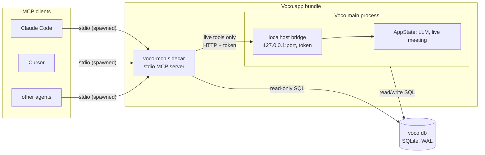

# Voco MCP integration — implementation plan

Status: planning only, nothing implemented. Written 2026-07-19 against commit `f05f5a1`.

## 1. Goal

Expose Voco's data — meetings, transcripts, summaries, notes, dictation history, dictionary —
to coding agents (Claude Code, Cursor, Windsurf, Codex CLI, Zed, anything MCP-capable) through
a Model Context Protocol server, so an agent can answer "what did we decide in yesterday's
standup?" or pull the last dictation into a commit message without the user copy-pasting.

Setup must be near-zero effort: a Settings panel with copy-paste config blocks per client,
plus a single "setup prompt" the user can paste into any coding agent that makes the agent
register the server itself.

### Non-goals (for this milestone)

- No cloud/remote access. Everything stays on the machine; Voco's privacy story is the product.
- No write actions by default (no starting recordings, no deleting meetings from an agent).
  A narrow, opt-in write surface is sketched in Phase 3 but ships disabled.
- No native Slack client inside Voco. See §10 — agents compose Voco MCP with a Slack MCP
  on their own; building Slack into Voco duplicates that badly. A simple outbound webhook
  is listed as an optional later phase if wanted.

## 2. What exists today (data inventory)

All data is in SQLite at `~/Library/Application Support/com.kashy.voco/voco.db`, owned by
the Tauri app through a single `rusqlite::Connection` behind a `parking_lot::Mutex`
([database.rs](../src-tauri/src/storage/database.rs:7)). **The DB is not in WAL mode** —
default rollback journal. This matters for cross-process access (§7).

Tables ([migrations.rs](../src-tauri/src/storage/migrations.rs)):

| table | columns | notes |
|---|---|---|
| `meetings` | id, title, created_at, duration, summary, source | source = `recording` \| `import` |
| `segments` | id, meeting_id, speaker_id, start_time, end_time, text, created_at | FK cascade on meeting delete; speaker FK `ON DELETE SET NULL` |
| `speakers` | id, name, profile_data, created_at | names include MOSS ids like `moss_{mid}_{n}` until renamed |
| `dictations` | id, text, created_at, duration_ms, model, audio_path, app, ai_enhanced | full dictation history incl. frontmost app |
| `settings` | key, value | also holds per-meeting blobs: `meeting_notes::{id}` (user's "My notes"), `ai_title::{id}`, `custom_templates`, `favorite_templates`, custom dictionary entries |

Existing backend logic worth reusing rather than reinventing:

- `search_transcripts(query)` — cross-meeting segment search ([commands/meeting.rs:219](../src-tauri/src/commands/meeting.rs))
- `get_meeting_transcript(meeting_id)` — segments with speaker resolution
- Export renderers for text / SRT / VTT / JSON (and Markdown) in [services/export.rs](../src-tauri/src/services/export.rs)
- `ask_meeting_ai(meeting_id, question, request_id)` — RAG-ish Q&A over transcript+summary using the user's configured LLM ([commands/llm.rs](../src-tauri/src/commands/llm.rs))

The problem: all of this is reachable only via Tauri `invoke` from the app's own webview.
Nothing is callable from outside the process.

## 3. Architecture decision

Three options were considered:

**A. Standalone stdio MCP binary reading SQLite directly.**
A small `voco-mcp` executable bundled inside the .app. MCP clients spawn it themselves
(stdio transport — the one transport every client supports with zero auth ceremony).
It opens `voco.db` read-only. Works even when Voco isn't running.
Weakness: cannot reach live app state (active meeting, the app's LLM pipeline).

**B. HTTP server embedded in the Tauri app.**
Streamable-HTTP MCP endpoint on `127.0.0.1:<port>` inside the running app. Full access to
`AppState` (live meeting, LLM, models). Weaknesses: only works while the app runs, needs a
bearer token (localhost HTTP is reachable by any local process), port management, and
several MCP clients still handle stdio far more smoothly than HTTP-with-auth.

**C. Hybrid (recommended): stdio sidecar + optional in-app bridge.**
`voco-mcp` (option A) is the only thing MCP clients ever see. Data tools hit SQLite
directly and always work, app running or not. "Live" tools (ask-AI, active-meeting status)
are proxied by the sidecar to the running app over a localhost HTTP bridge; if the app
isn't running they return a clear "Voco is not running" error instead of failing setup.



Phasing makes the hybrid cheap: Phase 1 ships option A alone (already covers ~90% of the
value — transcripts, notes, search, dictations are all in the DB). Phase 3 adds the bridge
without changing anything clients see.

### Rust MCP SDK

Use the official `rmcp` crate (modelcontextprotocol/rust-sdk). It provides the stdio
transport, `#[tool]`/`#[tool_router]` macros with JSON-schema derivation from typed
params, and a streamable-HTTP transport if we ever want option B externally. Pin the
current release at implementation time and note it in Cargo.toml with a comment (same
discipline as the transcribe-cpp git pin).

## 4. Workspace restructure — `voco-core`

`voco-mcp` must not duplicate the storage layer. Extract a library crate:

```
src-tauri/
  Cargo.toml            → becomes a [workspace] with three members
  crates/
    voco-core/          → NEW: storage/ (database, migrations, models), services/export.rs,
                           the pure parts of text_processing (no CGEvent/AX deps)
    voco-mcp/           → NEW: MCP server binary (rmcp, stdio), ~500 lines
  src/                  → Tauri app, now depends on voco-core
```

Rules for the split:

- `voco-core` gets: `storage/*`, `services/export.rs`, model structs (`Meeting`, `Segment`,
  `DictationEntry`, `SearchHit`). Nothing that links AppKit/CoreGraphics/objc — the sidecar
  must stay a dependency-light, fast-launching binary (MCP clients spawn it per session;
  target < 100 ms cold start, which rules out linking ORT/whisper/ggml).
- The Tauri app's imports change from `crate::storage::…` to `voco_core::storage::…`;
  this is a mechanical find-replace plus Cargo.toml surgery, no behavior change.
- Migrations stay in voco-core but **only the app runs them**. The sidecar opens the DB
  read-only and refuses to migrate (see §7) — otherwise a newer sidecar spawned while an
  older app runs could race the schema.

## 5. Bundling and distribution

- Add `voco-mcp` as a Tauri sidecar: `bundle.externalBin: ["binaries/voco-mcp"]` in
  tauri.conf.json. Tauri requires the file on disk to carry the target-triple suffix
  (`voco-mcp-aarch64-apple-darwin`) and strips it at bundle time — add a build script step
  that cargo-builds the crate and copies it to `src-tauri/binaries/` with the suffix
  before `tauri build`. It lands at a **stable, documentable path**:
  `/Applications/Voco.app/Contents/MacOS/voco-mcp`.
- Code signing: sidecars inside the bundle are signed along with the app by the existing
  "Voco Dev" identity / CI signing step. Verify with `codesign -dv` on the installed app;
  Gatekeeper will kill an unsigned sidecar spawned by a signed app.
- CI (release.yml) needs one extra step: build the sidecar for aarch64 before the tauri
  build. Homebrew tap and DMG pick it up for free since it lives inside the .app.
- Dev mode: `tauri dev` resolves sidecars from `src-tauri/binaries/`; the Settings panel
  (§9) must show the *actual* resolved path, not a hardcoded /Applications one, so testing
  in dev works.

## 6. MCP surface

Design principles: read-only; every tool result capped in size (agents pay tokens for
whatever we return); stable IDs everywhere so an agent can list → drill down; ISO-8601
timestamps; speaker names resolved (never raw speaker_ids in text output).

### Tools

| tool | params | returns | notes |
|---|---|---|---|
| `list_meetings` | `limit` (default 20, max 100), `source` (`recording`\|`import`\|`all`), `from`/`to` ISO dates, `query` (title substring) | id, title (AI title if set, else stored title), created_at, duration_s, source, has_summary, has_notes, speaker names | newest first |
| `get_meeting` | `meeting_id` (or literal `latest`) | metadata + summary + user notes (`meeting_notes::{id}`) + speakers + segment_count | everything except the transcript body |
| `get_transcript` | `meeting_id`, `format` (`text`\|`json`\|`markdown`, default text), `offset_s`, `limit_chars` (default 20 000, max 50 000) | speaker-labelled transcript window + `truncated`/`next_offset_s` cursor | reuses export.rs renderers; pagination is mandatory — a 1 h meeting is ~60–80k chars |
| `search` | `query`, `scope` (`meetings`\|`dictations`\|`all`), `limit` (default 20) | hits with meeting/dictation id, timestamp, speaker, ±1 segment of context | wraps `search_transcripts` + a LIKE query over dictations; consider FTS5 later (§13) |
| `list_dictations` | `limit` (default 20, max 200), `since` ISO date, `app` substring | id, text (truncate each to ~500 chars in list view), created_at, duration_ms, app | |
| `get_dictation` | `id` (or `latest`) | full text + metadata | the "put my last dictation in this file" workflow |
| `get_dictionary` | — | the custom dictionary / word-replacement entries | lets an agent spell project terms the way the user does |
| `get_status` | — | app_running (bridge probe), db_path, meeting_count, dictation_count, schema_version | first call an agent makes; doubles as setup diagnostics |
| `ask_meeting_ai` *(Phase 3)* | `meeting_id?`, `question` | the app's LLM answer | proxied to the bridge; error "Voco is not running — data tools still work" when app is closed |
| `get_active_meeting` *(Phase 3)* | — | live meeting id/title/elapsed, or none | proxied |

### Resources

Resources let clients attach content without a tool round-trip (Claude Code `@`-mentions):

- `voco://meetings/recent` — compact list, mirrors `list_meetings` defaults
- `voco://meeting/{id}` — metadata + summary + notes
- `voco://meeting/{id}/transcript` — full text transcript (resource readers accept large payloads; still hard-cap at ~200 KB)
- `voco://dictations/recent` — last 20 dictations

### Prompts

Two MCP prompts, because they make demos and daily use dramatically better:

- `meeting-context` (`meeting_id?`) — expands to "Here is the transcript and summary of
  <title>… use it as context for my next request" with the content inlined.
- `standup-summary` — pulls today's meetings and asks the agent to draft a standup update.

## 7. Cross-process SQLite: the one hard technical problem

Two processes will now touch `voco.db`: the app (read/write, possibly mid-meeting with
segment inserts every few seconds) and one or more sidecar instances (read-only — each MCP
client spawns its own sidecar).

Required changes:

1. **Switch the app to WAL** (`PRAGMA journal_mode=WAL;` at open, one-time migration).
   WAL is the only journal mode where readers never block the writer and vice versa. In
   the current rollback-journal mode, a sidecar holding a read transaction would make the
   app's inserts fail with SQLITE_BUSY mid-meeting — unacceptable.
2. Sidecar opens with `SQLITE_OPEN_READ_ONLY | SQLITE_OPEN_NO_MUTEX`, sets
   `PRAGMA busy_timeout = 2000` and `PRAGMA query_only = ON` (belt and braces).
3. Sidecar never runs migrations. On open it checks `user_version` / expected tables; on
   mismatch it returns a structured error telling the user to launch/update Voco.
4. App side: also set `busy_timeout` on its connection (currently unset — any transient
   contention today just errors).
5. WAL leaves `-wal`/`-shm` files next to the DB; nothing in the app assumes a single
   file (verify backup/reveal-in-Finder paths if any exist).

Sequence for a typical call:

```mermaid
sequenceDiagram
    participant A as Coding agent (Claude Code)
    participant S as voco-mcp (stdio)
    participant D as voco.db (WAL)
    participant V as Voco app bridge (only Phase 3)

    A->>S: spawn + initialize (MCP handshake)
    S-->>A: capabilities: tools, resources, prompts
    A->>S: tools/call get_transcript {meeting_id, limit_chars}
    S->>D: read-only snapshot query
    D-->>S: segments + speakers
    S-->>A: labelled transcript (truncated=false)
    A->>S: tools/call ask_meeting_ai {question}
    S->>V: POST 127.0.0.1:port/bridge (token)
    alt app running
        V-->>S: LLM answer
        S-->>A: answer
    else app closed
        S-->>A: error: "Voco is not running; live tools unavailable"
    end
```

## 8. Security and privacy model

- **Master switch**: new setting `mcp_enabled` (default **off**). The sidecar checks it on
  startup and, if off, serves only `get_status` (which says "MCP disabled in Voco
  Settings") — this way a half-configured client shows a helpful error, not a hang.
  Rationale for default-off: transcripts are the most sensitive data on the machine, and
  any local process can spawn the sidecar. Enabling is one toggle in the panel that also
  hands you the configs, so friction is near zero.
- **Bridge token** (Phase 3): random 32-byte token generated on first enable, stored in
  the settings table, required as `Authorization: Bearer` by the localhost bridge. The
  sidecar reads it from the DB — no user handling ever. Bridge binds `127.0.0.1` only.
- **Audio stays private**: no tool returns `audio_path` or serves audio bytes.
- **Redaction hook**: single choke-point function in voco-mcp through which all returned
  text passes; empty today, but the place for a future "exclude meetings tagged private"
  filter. Cheap now, painful to retrofit.
- **Access log**: sidecar appends one line per tool call (tool, params minus content,
  client name from MCP `clientInfo`) to `~/Library/Logs/Voco-MCP.log`, viewable in the
  existing Settings → Logs viewer (add a source dropdown). Users should be able to see
  what their agents read.

## 9. Onboarding UX — Settings → Integrations

New settings tab "Integrations" (component `src/components/settings/IntegrationsSettings.tsx`):

1. **Enable toggle** → `mcp_enabled`, shows green "server available" state and the
   resolved sidecar path.
2. **Per-client setup cards**, each with a copy button:
   - *Claude Code*:
     `claude mcp add voco -- /Applications/Voco.app/Contents/MacOS/voco-mcp`
   - *Cursor*: the JSON block for `~/.cursor/mcp.json`
     (`{"mcpServers":{"voco":{"command":"/Applications/Voco.app/Contents/MacOS/voco-mcp"}}}`),
     plus a one-click `cursor://anysphere.cursor-deeplink/mcp/install?name=voco&config=<base64>`
     deep-link button.
   - *Generic / everything else*: the same JSON block, which is the de-facto standard
     (Windsurf, Codex CLI, Zed all accept a variant of it).
3. **"Copy setup prompt"** — the headline feature the user asked for: one prompt pasted
   into any coding agent makes the agent do its own registration. Draft text (bundled as a
   template, path substituted at render time):

   > Add Voco (my local meeting-notes and dictation app) as an MCP server named `voco`.
   > The server binary is at `/Applications/Voco.app/Contents/MacOS/voco-mcp` and uses
   > stdio transport with no arguments and no environment variables. Detect which agent
   > you are and register it in your own config: for Claude Code run
   > `claude mcp add voco -- <path>`; for Cursor add it to `~/.cursor/mcp.json` under
   > `mcpServers.voco.command`; otherwise add the equivalent stdio server entry to your
   > MCP config. Then verify by calling the `get_status` tool and tell me how many
   > meetings and dictations you can see.

   The verification step at the end is what makes this reliable — the agent self-checks
   instead of silently misconfiguring.
4. **Status/diagnostics row**: "Test connection" button that spawns the sidecar with a
   synthetic `initialize` + `get_status` round-trip and reports the result inline.

## 10. Slack and other integrations

Recommendation: **do not build Slack into Voco now.** The MCP design already covers it:
a user whose agent has both the Voco MCP and a Slack MCP can say "summarize today's
meeting and post it to #standup" and the agent composes the two. Building a native Slack
client means OAuth app review, token storage, and a settings surface — for a flow agents
already do better.

If a push-style integration is wanted later (Phase 4, optional): a generic **outbound
webhook** — setting `webhook_url` + toggle "POST summary JSON when a meeting finishes" —
covers Slack (incoming webhooks), Discord, Zapier, and n8n with ~50 lines of Rust and no
OAuth. That is the most leverage per line if the need materializes.

## 11. Phased implementation

**Phase 0 — foundations (no user-visible change)**
- Convert `src-tauri` to a cargo workspace; extract `voco-core` (storage, models,
  export, pure text utils). App compiles against it; all existing tests pass.
- WAL migration + `busy_timeout` on the app connection.
- Risk gate: run a full meeting + dictation session on WAL before proceeding.

**Phase 1 — the sidecar (core value)**
- `crates/voco-mcp`: rmcp stdio server; tools `get_status`, `list_meetings`,
  `get_meeting`, `get_transcript`, `search`, `list_dictations`, `get_dictation`,
  `get_dictionary`; resources + the two prompts; read-only DB handling per §7;
  access log; `mcp_enabled` gate.
- Build-script + tauri.conf.json sidecar bundling; CI step; codesign verification.

**Phase 2 — onboarding UI**
- Integrations settings tab: toggle, config cards, setup prompt, deep link, test button.
- Logs viewer source dropdown (Voco.log / Voco-MCP.log).
- README + docs page ("Connect Voco to your coding agent").

**Phase 3 — live bridge**
- Tiny HTTP listener in the app (bind 127.0.0.1, random port written to a settings key,
  bearer token per §8) exposing `ask_ai` and `active_meeting`.
- Sidecar proxies `ask_meeting_ai` / `get_active_meeting`; graceful "app not running".

**Phase 4 — optional, decide later**
- Outbound webhook on meeting finish (§10).
- Opt-in write tools behind a second setting (`mcp_allow_write`): `append_meeting_note`,
  `set_meeting_title`. Nothing destructive, ever.
- FTS5 index if `search` feels slow past a few hundred meetings.

## 12. Testing and verification

- Unit tests in voco-mcp for every tool against `Database::new_in_memory()` fixtures
  (empty DB, meeting with unnamed MOSS speakers, 90-minute transcript hitting the
  truncation path, dictations with/without app column).
- Protocol-level: MCP Inspector (`npx @modelcontextprotocol/inspector <sidecar>`) against
  the real dev DB — handshake, tool list, each tool, resource reads.
- Concurrency: scripted soak — record a live meeting while a loop hammers
  `get_transcript`/`search` from three sidecar processes; assert zero SQLITE_BUSY in
  Voco.log and no missed segment inserts.
- End-to-end: `claude mcp add voco …` on this machine, then in a fresh Claude Code
  session: "use voco to summarize my latest meeting". Same via the Cursor deep link.
- Release check: install from the built DMG, confirm the sidecar path, codesign, and the
  setup prompt work from /Applications.

## 13. Risks and gotchas

- **WAL migration is the only change that touches existing behavior.** Do it first, alone,
  and soak it (Phase 0 gate). Everything else is additive.
- **Schema drift**: sidecar and app ship together in the .app, but a user can point an old
  registered sidecar path at a new DB (e.g. after moving the app). The `user_version`
  check in §7 turns that into a clear error.
- **Token blow-ups**: transcripts are huge; the `limit_chars` + cursor design must be
  enforced server-side, never trusted to the client asking nicely.
- **Sidecar launch cost**: keep voco-mcp free of ORT/ggml/objc so spawn stays instant;
  watch Cargo feature unification in the workspace (a shared dep pulling heavy features
  into voco-core would bloat the sidecar — check with `cargo tree`).
- **Multiple simultaneous clients** each spawn a sidecar; read-only WAL readers make this
  safe, but the access log needs O_APPEND single-line writes to avoid interleaving.
- **rmcp API churn**: the SDK is young; pin the version and vendor-check examples at
  implementation time rather than trusting docs from memory.
- **`settings`-table blobs**: notes/AI titles live in `settings` keys
  (`meeting_notes::{id}`), which voco-mcp must know about — extract the key-format
  constants into voco-core so the two binaries can't drift.

## 14. Open questions (decide during implementation, none block Phase 0/1)

1. Should `list_meetings` return the AI-suggested title when the stored title is a bare
   date/default? (Plan says yes — agents match on meaning, not "Meeting 2026-07-19".)
2. Homebrew-cask users may have the app in `~/Applications` — the setup prompt template
   should substitute the *actual* install path at copy time rather than hardcoding.
3. Does the dictionary live under one settings key or several? Confirm the exact key(s)
   when wiring `get_dictionary`.
4. Expose file-transcription imports as their own tool filter or leave them under
   `list_meetings(source=import)`? (Plan: the latter; they are meetings in the DB.)
